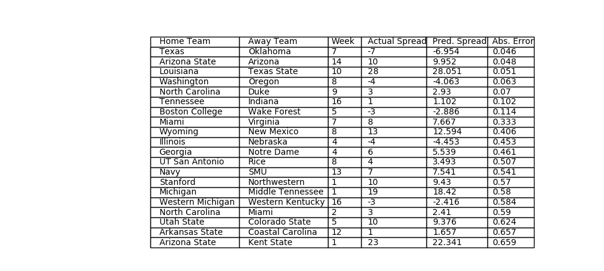

# cfb_predictor
Rating college football teams

## Installation
Can be installed from PyPi using pip install cfb_predictor

## Usage
The following will scrape and preprocess data from the 2013-2018 seasons, train the model on that data, and test the model on the 2019 season. The per-week errors and the total 2019 error will be printed.
```python
import cfb_predictor as cfb
cfb.model_training.train(2013, 2018)
cfb.model_testing.model_test(2019)
```

## Rating system
The model rates college football teams using neural networks with one hidden layer. The model has been built from scratch in Python, using only pandas, numpy, and Python's built-in packages.

### Input data
For a given team _t_ and week of the season _w_, the model calculates a rating for _t_ at _w_ using _t_'s cumulative statistics for all weeks _wi_ < _w_. The package includes modules to pull and appropriately transform statistics from the collegefootballapi located here: https://api.collegefootballdata.com/api/docs/?url=/api-docs.json#/. Right now, the package is only able to pull "advanced" per-game statistics.

In addition to the per-game statistics, the model's rating calculations also depend on a team's talent, their strength of schedule (SOS), and last season's rating. Talent ratings are 247's composite talent ratings pulled from the same source. The composite ratings only go back to 2015, so for prior seasons the composite rating is approximated.

### Different weeks of the season, different neural networks
As the season progresses, the importance of different types of inputs for prediction can change drastically. For instance, early in the season a team's last rating and talent will be much more predictive of their performance than their cumulative efficiency statistics, since the efficiency statistics will be based on few or no games. As more games are played, the larger sample will make these efficiency statistics much more predictive of future performance.

With this in mind, the model actually uses multiple neural networks, one each for weeks 1-13+. Though this comes with a cost of a smaller training set for the individual neural networks, I've found that this does lead to better peformance than a single neural network for all weeks. 

## Training
The model is trained by predicting game margins (home team points - away team points). To make a prediction, the model calculates ratings between 0 and 1 for the home and away teams. The predicted margin is 80*(home team rating - away team rating) + _a_, where _a_ represents home-field advantage and is trained simultaneously with the ratings neural networks. Training uses backpropagation, specifically stochastic gradient descent with early stopping.  

The neural network for week _w_ is trained using data from an adjustable window around _w_.

## Results
Trained on the 2013-2018 seasons, the model regularly achieves a mean absolute error of <12.8 points when predicting the margin of FBS games in the 2019 season. For comparison with other rating systems, follow this link: http://www.thepredictiontracker.com/ncaaresults.php?orderby=absdev&type=1&year=19 . 

The below table displays the best 2019 predictions of a model trained on the 2014-2018 seasons:


